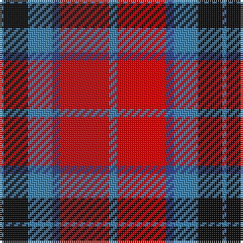

The parent of this is [Thompson/Thomson/MacTavish](/tartans/b/2/k12/b12/ba4/r24/b/4/)

This was sourced from register-of-tartans.  It is a [6 stripes tartan](/stripes/stripes6/).

Original link https://www.tartanregister.gov.uk/tartanDetails.aspx?ref=4114

## Thread count
B/2 K12 B12 Ba4 R24 B/4

## Palette
Each colour and its ΔE from the base-6 reference it is a variant of.

| Colour | Shade | Base | ΔE (OKLab) |
|---|---|---|---|
| B |  `#3C82AF` | B  | 0.20 |
| Ba |  `#2C4084` | B  | 0.00 |
| K |  `#101010` | K  | 0.17 |
| R |  `#DC0000` | R  | 0.04 |

# Sample pattern

ID: /variants/b/2/k12/b12/ba4/r24/b/4-b3c82af-ba2c4084-k101010-rdc0000/
