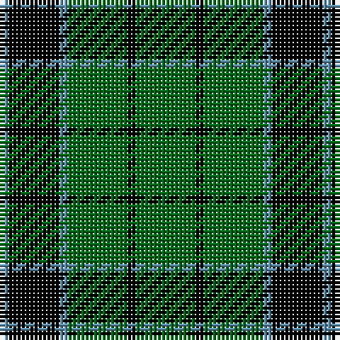

The parent of this is [Innes, Georgina (Portrait)](/tartans/b/2/k12/b2/g14/k2/g/14/)

This was sourced from tartans-authority.  It is a [6 stripes tartan](/stripes/stripes6/).

Original link http://www.tartansauthority.com/tartan-ferret/display/235/

## Thread count
B/2 K12 B2 G14 K2 G/14

## Palette
Each colour and its ΔE from the base-6 reference it is a variant of.

| Colour | Shade | Base | ΔE (OKLab) |
|---|---|---|---|
| B |  `#5C8CA8` | B  | 0.23 |
| G |  `#006818` | G  | 0.02 |
| K |  `#000000` | K  | 0.00 |

# Sample pattern

ID: /variants/b/2/k12/b2/g14/k2/g/14-b5c8ca8-g006818-k000000/
