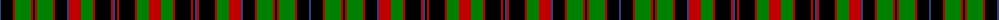

The parent of this is [Comyn / Cumming, Buchan](/tartans/b/2/k12/r2/g16/r2/k2/r2/g16/r2/k12/b2/r12/g12/r2/k16/r2/b2/k2/r2/k16/r2/g12/r/12/)

This was sourced from weddslist.  It is a [23 stripes tartan](/stripes/stripes23/).

Original link http://www.weddslist.com/cgi-bin/tartans/pg.pl?source=sts

## Thread count
B/2 K12 R2 G16 R2 K2 R2 G16 R2 K12 B2 R12 G12 R2 K16 R2 B2 K2 R2 K16 R2 G12 R/12

## Palette
Each colour and its ΔE from the base-6 reference it is a variant of.

| Colour | Shade | Base | ΔE (OKLab) |
|---|---|---|---|
| B |  `#304080` | B  | 0.01 |
| G |  `#008000` | G  | 0.09 |
| K |  `#000000` | K  | 0.00 |
| R |  `#C00000` | R  | 0.02 |

ID: /variants/b/2/k12/r2/g16/r2/k2/r2/g16/r2/k12/b2/r12/g12/r2/k16/r2/b2/k2/r2/k16/r2/g12/r/12-b304080-g008000-k000000-rc00000/
