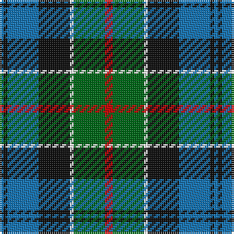

The parent of this is [Colquhoun #2](/tartans/b/2/k2/b16/k16/w2/g16/r/4/)

This was sourced from register-of-tartans.  It is a [7 stripes tartan](/stripes/stripes7/).

Original link https://www.tartanregister.gov.uk/tartanDetails.aspx?ref=715

## Thread count
B/2 K2 B16 K16 W2 G16 R/4

## Palette
Each colour and its ΔE from the base-6 reference it is a variant of.

| Colour | Shade | Base | ΔE (OKLab) |
|---|---|---|---|
| B |  `#1474B4` | B  | 0.15 |
| DB |  `#2C2C80` | B  | 0.05 |
| DG |  `#003820` | G  | 0.16 |
| G |  `#006818` | G  | 0.02 |
| Ga |  `#285800` | G  | 0.04 |
| K |  `#101010` | K  | 0.17 |
| N |  `#C0C0C0` | W  | 0.16 |
| R |  `#C80000` | R  | 0.00 |
| W |  `#FCFCFC` | W  | 0.03 |

# Sample pattern

ID: /variants/b/2/k2/b16/k16/w2/g16/r/4-b1474b4-db2c2c80-dg003820-g006818-ga285800-k101010-nc0c0c0-rc80000-wfcfcfc/
