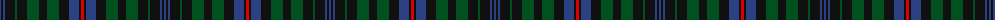

The parent of this is [Unidentified #10](/tartans/b/2/k2/b2/k10/g2/k10/g12/k8/g12/k10/b10/k2/r/3/)

This was sourced from register-of-tartans.  It is a [13 stripes tartan](/stripes/stripes13/).

Original link https://www.tartanregister.gov.uk/tartanDetails.aspx?ref=4211

## Thread count
B/2 K2 B2 K10 G2 K10 G12 K8 G12 K10 B10 K2 R/3

## Palette
Each colour and its ΔE from the base-6 reference it is a variant of.

| Colour | Shade | Base | ΔE (OKLab) |
|---|---|---|---|
| B |  `#2C4084` | B  | 0.00 |
| G |  `#005020` | G  | 0.08 |
| K |  `#101010` | K  | 0.17 |
| R |  `#DC0000` | R  | 0.04 |

ID: /variants/b/2/k2/b2/k10/g2/k10/g12/k8/g12/k10/b10/k2/r/3-b2c4084-g005020-k101010-rdc0000/
