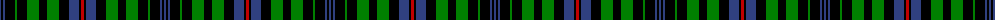

The parent of this is [Unnamed 5](/tartans/b/2/k2/b2/k10/g2/k10/g12/k8/g12/k10/b10/k2/r/3/)

This was sourced from weddslist.  It is a [13 stripes tartan](/stripes/stripes13/).

Original link http://www.weddslist.com/cgi-bin/tartans/pg.pl?source=sts

## Thread count
B/2 K2 B2 K10 G2 K10 G12 K8 G12 K10 B10 K2 R/3

## Palette
Each colour and its ΔE from the base-6 reference it is a variant of.

| Colour | Shade | Base | ΔE (OKLab) |
|---|---|---|---|
| B |  `#304080` | B  | 0.01 |
| G |  `#008000` | G  | 0.09 |
| K |  `#000000` | K  | 0.00 |
| R |  `#C00000` | R  | 0.02 |

ID: /variants/b/2/k2/b2/k10/g2/k10/g12/k8/g12/k10/b10/k2/r/3-b304080-g008000-k000000-rc00000/
