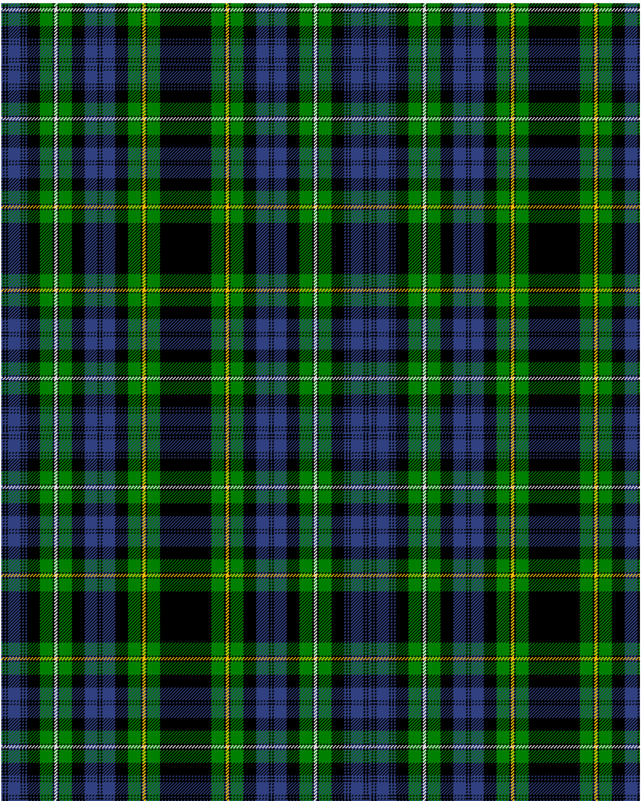

Campbell of Argyll

This was sourced from <no value>.  It is a 28 stripes tartan.

Original link http://www.weddslist.com/cgi-bin/tartans/pg.pl?source=sts

## Thread count
B/2 K2 B2 K2 B16 K2 B2 K2 B2 K16 G16 K2 LN4 K2 G16 K16 B16 K2 B2 K2 B16 K16 G16 K2 Y4 K2 G16 K/32

## Palette
B#304080 G#008000 K#000000 LN#E0E0E0 Y#F0C000

# Sample pattern

ID: /variants/b/2/k2/b2/k2/b16/k2/b2/k2/b2/k16/g16/k2/ln4/k2/g16/k16/b16/k2/b2/k2/b16/k16/g16/k2/y4/k2/g16/k/32-b304080-g008000-k000000-lne0e0e0-yf0c000