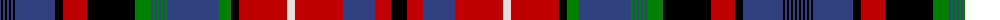

The parent of this is [13, Confederation](/tartans/b/2/k2/b2/k2/b2/k2/b2/k2/b40/k8/r24/k48/g16/b2/g2/b2/g2/b2/g2/b2/g2/b52/g12/k8/r48/ln8/r48/b32/r16/k/16/)

This was sourced from weddslist.  It is a [30 stripes tartan](/stripes/stripes30/).

Original link http://www.weddslist.com/cgi-bin/tartans/pg.pl?source=sts

## Thread count
B/2 K2 B2 K2 B2 K2 B2 K2 B40 K8 R24 K48 G16 B2 G2 B2 G2 B2 G2 B2 G2 B52 G12 K8 R48 LN8 R48 B32 R16 K/16

## Palette
Each colour and its ΔE from the base-6 reference it is a variant of.

| Colour | Shade | Base | ΔE (OKLab) |
|---|---|---|---|
| B |  `#304080` | B  | 0.01 |
| G |  `#008000` | G  | 0.09 |
| K |  `#000000` | K  | 0.00 |
| LN |  `#E0E0E0` | W  | 0.06 |
| R |  `#C00000` | R  | 0.02 |

ID: /variants/b/2/k2/b2/k2/b2/k2/b2/k2/b40/k8/r24/k48/g16/b2/g2/b2/g2/b2/g2/b2/g2/b52/g12/k8/r48/ln8/r48/b32/r16/k/16-b304080-g008000-k000000-lne0e0e0-rc00000/
