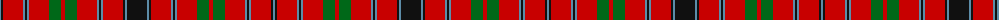

The parent of this is [Unidentified (Scolpaig)](/tartans/b/2/k2/r20/b2/k2/b2/r20/g12/r4/g12/r20/b2/k2/b2/r20/k2/b2/k/20/)

This was sourced from register-of-tartans.  It is a [18 stripes tartan](/stripes/stripes18/).

Original link https://www.tartanregister.gov.uk/tartanDetails.aspx?ref=4271

## Thread count
B/2 K2 R20 B2 K2 B2 R20 G12 R4 G12 R20 B2 K2 B2 R20 K2 B2 K/20

## Palette
Each colour and its ΔE from the base-6 reference it is a variant of.

| Colour | Shade | Base | ΔE (OKLab) |
|---|---|---|---|
| B |  `#5C8CA8` | B  | 0.23 |
| G |  `#006818` | G  | 0.02 |
| K |  `#101010` | K  | 0.17 |
| R |  `#C80000` | R  | 0.00 |

ID: /variants/b/2/k2/r20/b2/k2/b2/r20/g12/r4/g12/r20/b2/k2/b2/r20/k2/b2/k/20-b5c8ca8-g006818-k101010-rc80000/
