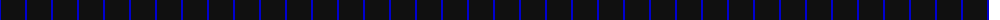
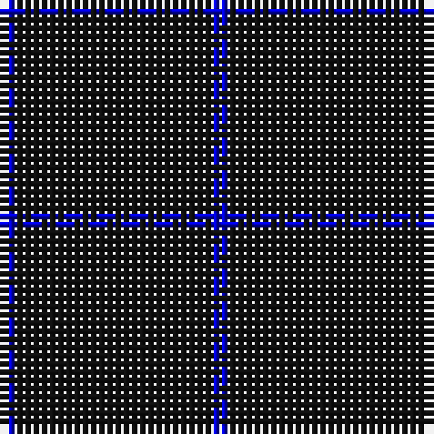

The parent of this is [Staines (2013)](/tartans/b/2/k24/b/2/)

This was sourced from register-of-tartans.  It is a [3 stripes tartan](/stripes/stripes3/).

Original link https://www.tartanregister.gov.uk/tartanDetails.aspx?ref=10857

## Thread count
B/2 K24 B/2

## Palette
Each colour and its ΔE from the base-6 reference it is a variant of.

| Colour | Shade | Base | ΔE (OKLab) |
|---|---|---|---|
| B |  `#0000CD` | B  | 0.15 |
| K |  `#101010` | K  | 0.17 |

# Sample pattern

ID: /variants/b/2/k24/b/2-b0000cd-k101010/
