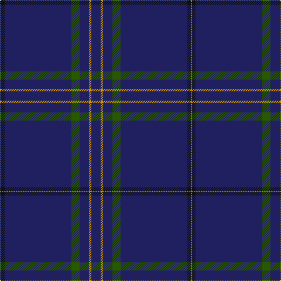

The parent of this is [Cullen (Christian Hill)](/tartans/b/2/k6/db114/g14/db16/dy4/db/16/)

This was sourced from tartans-authority.  It is a [7 stripes tartan](/stripes/stripes7/).

Original link http://www.tartansauthority.com/tartan-ferret/display/10858/

## Thread count
B/2 K6 DB114 G14 DB16 DY4 DB/16

## Palette
Each colour and its ΔE from the base-6 reference it is a variant of.

| Colour | Shade | Base | ΔE (OKLab) |
|---|---|---|---|
| B |  `#5C8CA8` | B  | 0.23 |
| DB |  `#202060` | B  | 0.11 |
| DY |  `#D09800` | Y  | 0.11 |
| G |  `#285800` | G  | 0.04 |
| K |  `#101010` | K  | 0.17 |

# Sample pattern

ID: /variants/b/2/k6/db114/g14/db16/dy4/db/16-b5c8ca8-db202060-dyd09800-g285800-k101010/
