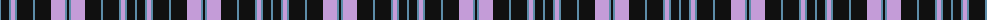

The parent of this is [Clark (Crook)](/tartans/b/2/k8/b2/lp4/b2/k16/b2/k16/lp14/b2/k/2/)

This was sourced from tartans-authority.  It is a [11 stripes tartan](/stripes/stripes11/).

Original link http://www.tartansauthority.com/tartan-ferret/display/8967/

## Thread count
B/2 K8 B2 LP4 B2 K16 B2 K16 LP14 B2 K/2

## Palette
Each colour and its ΔE from the base-6 reference it is a variant of.

| Colour | Shade | Base | ΔE (OKLab) |
|---|---|---|---|
| B |  `#5C8CA8` | B  | 0.23 |
| K |  `#101010` | K  | 0.17 |
| LP |  `#C49CD8` | W  | 0.24 |

ID: /variants/b/2/k8/b2/lp4/b2/k16/b2/k16/lp14/b2/k/2-b5c8ca8-k101010-lpc49cd8/
