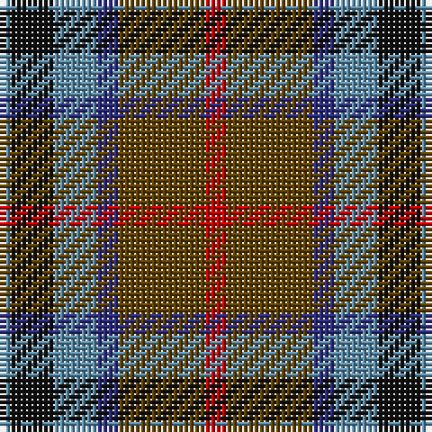

The parent of this is [Thompson's Fancy Personal Tartan Tartan Number: 286. Earliest known date: pre 2003 Designed for his own use. See products available Copyright © Blair Urquhart, Comrie, 2015](/tartans/b/2/k8/b8/db4/t16/r/4/)

This was sourced from house-of-tartan.  It is a [6 stripes tartan](/stripes/stripes6/).

Original link http://www.house-of-tartan.scotland.net/house/TartanViewjs.asp?colr=Def&tnam=286

## Thread count
B/2 K8 B8 DB4 T16 R/4

## Palette
Each colour and its ΔE from the base-6 reference it is a variant of.

| Colour | Shade | Base | ΔE (OKLab) |
|---|---|---|---|
| B |  `#5C8CA8` | B  | 0.23 |
| DB |  `#2C2C80` | B  | 0.05 |
| K |  `#101010` | K  | 0.17 |
| R |  `#C80000` | R  | 0.00 |
| T |  `#604000` | G  | 0.14 |

# Sample pattern

ID: /variants/b/2/k8/b8/db4/t16/r/4-b5c8ca8-db2c2c80-k101010-rc80000-t604000/
