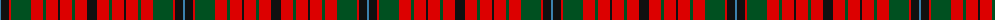

The parent of this is [Nicolson MacNicol](/tartans/b/2/k8/r2/g20/r12/g3/r12/k2/r12/g3/r12/k/10/)

This was sourced from register-of-tartans.  It is a [12 stripes tartan](/stripes/stripes12/).

Original link https://www.tartanregister.gov.uk/tartanDetails.aspx?ref=3138

## Thread count
B/2 K8 R2 G20 R12 G3 R12 K2 R12 G3 R12 K/10

## Palette
Each colour and its ΔE from the base-6 reference it is a variant of.

| Colour | Shade | Base | ΔE (OKLab) |
|---|---|---|---|
| B |  `#3C82AF` | B  | 0.20 |
| G |  `#005020` | G  | 0.08 |
| K |  `#101010` | K  | 0.17 |
| R |  `#DC0000` | R  | 0.04 |

ID: /variants/b/2/k8/r2/g20/r12/g3/r12/k2/r12/g3/r12/k/10-b3c82af-g005020-k101010-rdc0000/
