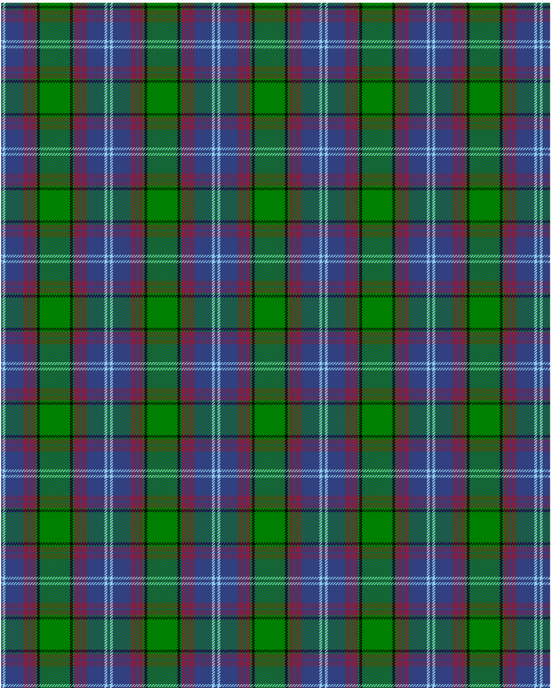

Dunbartonshire

This was sourced from <no value>.  It is a 9 stripes tartan.

Original link http://www.weddslist.com/cgi-bin/tartans/pg.pl?source=sts

## Thread count
B/2 LB4 B26 DR8 B2 DR8 G2 K4 G/22

## Palette
B#304080 DR#802040 G#008000 K#000000 LB#90D0F0

# Sample pattern

ID: /variants/b/2/lb4/b26/dr8/b2/dr8/g2/k4/g/22-b304080-dr802040-g008000-k000000-lb90d0f0