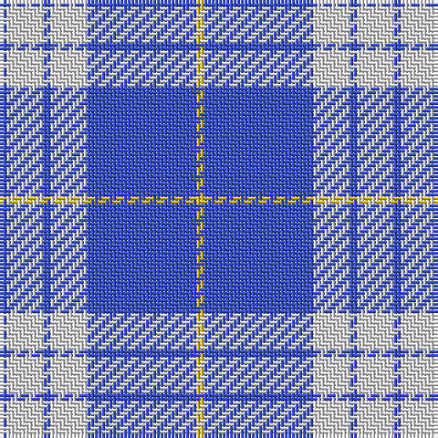

The parent of this is [Whitley (Personal)](/tartans/b/2/ln10/b2/ln10/b30/y/2/)

This was sourced from tartans-authority.  It is a [6 stripes tartan](/stripes/stripes6/).

Original link http://www.tartansauthority.com/tartan-ferret/display/7233/

## Thread count
B/2 LN10 B2 LN10 B30 Y/2

## Palette
Each colour and its ΔE from the base-6 reference it is a variant of.

| Colour | Shade | Base | ΔE (OKLab) |
|---|---|---|---|
| B |  `#3850C8` | B  | 0.12 |
| LN |  `#E0E0E0` | W  | 0.06 |
| Y |  `#E8C000` | Y  | 0.00 |

# Sample pattern

ID: /variants/b/2/ln10/b2/ln10/b30/y/2-b3850c8-lne0e0e0-ye8c000/
