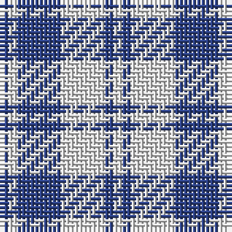

The parent of this is [Erskine Blanket](/tartans/b/2/ln2/b10/ln10/b2/ln/2/)

This was sourced from register-of-tartans.  It is a [6 stripes tartan](/stripes/stripes6/).

Original link https://www.tartanregister.gov.uk/tartanDetails.aspx?ref=1124

## Thread count
B/2 LN2 B10 LN10 B2 LN/2

## Palette
Each colour and its ΔE from the base-6 reference it is a variant of.

| Colour | Shade | Base | ΔE (OKLab) |
|---|---|---|---|
| B |  `#2C4084` | B  | 0.00 |
| LN |  `#E0E0E0` | W  | 0.06 |

# Sample pattern

ID: /variants/b/2/ln2/b10/ln10/b2/ln/2-b2c4084-lne0e0e0/
