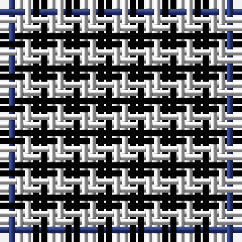

The parent of this is [Buccleuch, Check](/tartans/b/2/ln2/k2/ln2/k2/ln2/k2/ln/2/)

This was sourced from weddslist.  It is a [8 stripes tartan](/stripes/stripes8/).

Original link http://www.weddslist.com/cgi-bin/tartans/pg.pl?source=sts

## Thread count
B/2 LN2 K2 LN2 K2 LN2 K2 LN/2

## Palette
Each colour and its ΔE from the base-6 reference it is a variant of.

| Colour | Shade | Base | ΔE (OKLab) |
|---|---|---|---|
| B |  `#304080` | B  | 0.01 |
| K |  `#000000` | K  | 0.00 |
| LN |  `#E0E0E0` | W  | 0.06 |

# Sample pattern

ID: /variants/b/2/ln2/k2/ln2/k2/ln2/k2/ln/2-b304080-k000000-lne0e0e0/
