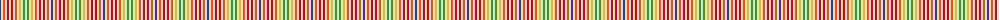

The parent of this is [Rainbow](/tartans/b/2/ln2/r2/ln2/ra2/ln2/ra2/ln2/r2/ln2/y2/ln2/g2/ln/2/)

This was sourced from register-of-tartans.  It is a [14 stripes tartan](/stripes/stripes14/).

Original link https://www.tartanregister.gov.uk/tartanDetails.aspx?ref=3441

## Thread count
B/2 LN2 R2 LN2 Ra2 LN2 Ra2 LN2 R2 LN2 Y2 LN2 G2 LN/2

## Palette
Each colour and its ΔE from the base-6 reference it is a variant of.

| Colour | Shade | Base | ΔE (OKLab) |
|---|---|---|---|
| B |  `#2C4084` | B  | 0.00 |
| G |  `#309C18` | G  | 0.18 |
| LN |  `#E0E0E0` | W  | 0.06 |
| R |  `#FA4B00` | R  | 0.14 |
| Ra |  `#DC0000` | R  | 0.04 |
| Y |  `#E8C000` | Y  | 0.00 |

ID: /variants/b/2/ln2/r2/ln2/ra2/ln2/ra2/ln2/r2/ln2/y2/ln2/g2/ln/2-b2c4084-g309c18-lne0e0e0-rfa4b00-radc0000-ye8c000/
