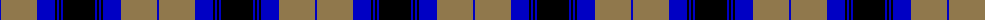
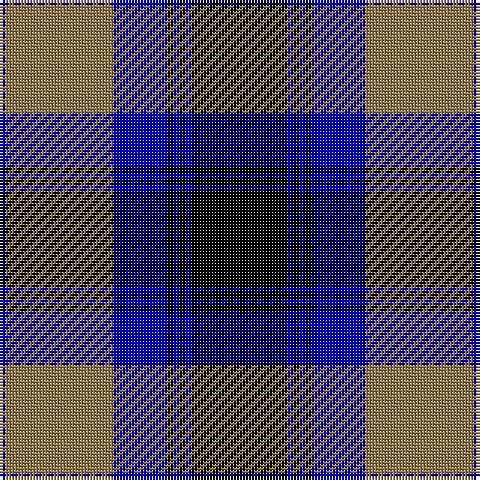

The parent of this is [Kelvingrove (Fashion)](/tartans/b/2/lt36/b18/k2/b2/k2/b2/k/32/)

This was sourced from tartans-authority.  It is a [8 stripes tartan](/stripes/stripes8/).

Original link http://www.tartansauthority.com/tartan-ferret/display/5326/

## Thread count
B/2 LT36 B18 K2 B2 K2 B2 K/32

## Palette
Each colour and its ΔE from the base-6 reference it is a variant of.

| Colour | Shade | Base | ΔE (OKLab) |
|---|---|---|---|
| B |  `#0000C4` | B  | 0.14 |
| K |  `#000000` | K  | 0.00 |
| LT |  `#90784C` | R  | 0.19 |

# Sample pattern

ID: /variants/b/2/lt36/b18/k2/b2/k2/b2/k/32-b0000c4-k000000-lt90784c/
