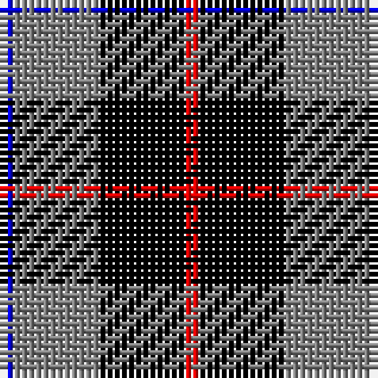

The parent of this is [Mayer, Chris (Personal)](/tartans/b/2/n12/k12/r/2/)

This was sourced from register-of-tartans.  It is a [4 stripes tartan](/stripes/stripes4/).

Original link https://www.tartanregister.gov.uk/tartanDetails.aspx?ref=10244

## Thread count
B/2 N12 K12 R/2

## Palette
Each colour and its ΔE from the base-6 reference it is a variant of.

| Colour | Shade | Base | ΔE (OKLab) |
|---|---|---|---|
| B |  `#0000FF` | B  | 0.21 |
| K |  `#000000` | K  | 0.00 |
| N |  `#808080` | G  | 0.22 |
| R |  `#FF0000` | R  | 0.11 |

# Sample pattern

ID: /variants/b/2/n12/k12/r/2-b0000ff-k000000-n808080-rff0000/
