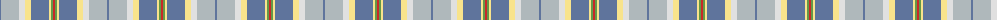
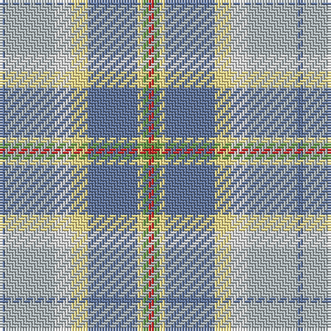

The parent of this is [Curd (2013)](/tartans/b/2/n18/ln6/ly6/b18/ly2/lg2/r/2/)

This was sourced from register-of-tartans.  It is a [8 stripes tartan](/stripes/stripes8/).

Original link https://www.tartanregister.gov.uk/tartanDetails.aspx?ref=10942

## Thread count
B/2 N18 LN6 LY6 B18 LY2 LG2 R/2

## Palette
Each colour and its ΔE from the base-6 reference it is a variant of.

| Colour | Shade | Base | ΔE (OKLab) |
|---|---|---|---|
| B |  `#5F749C` | B  | 0.17 |
| LG |  `#649848` | G  | 0.19 |
| LN |  `#E0E0E0` | W  | 0.06 |
| LY |  `#F8E38C` | Y  | 0.11 |
| N |  `#AFB8BB` | Y  | 0.18 |
| R |  `#C82828` | R  | 0.03 |

# Sample pattern

ID: /variants/b/2/n18/ln6/ly6/b18/ly2/lg2/r/2-b5f749c-lg649848-lne0e0e0-lyf8e38c-nafb8bb-rc82828/
