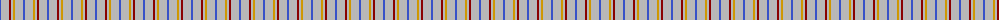
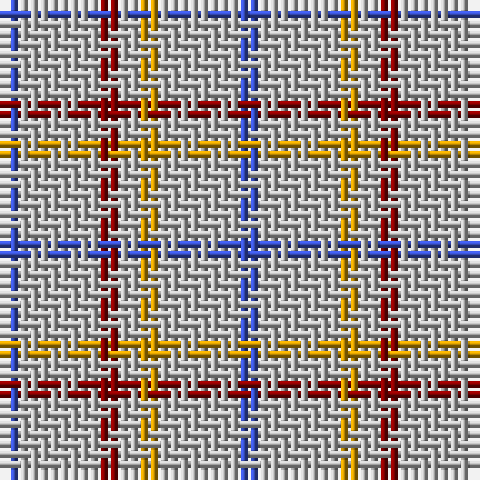

The parent of this is [Justus Dress Personal Tartan Tartan Number: 2500. Earliest known date: 1986 One of 7 tartans created by Christopher Carlisle Justus in Hendersonville NC - 1986. Status not known and no evidence of actual commercial weaving although it is said to have been adopted by the Justus Family Society. See products available Copyright © Blair Urquhart, Comrie, 2015](/tartans/b/2/n8/dr2/n2/dy2/n8/b/2/)

This was sourced from house-of-tartan.  It is a [7 stripes tartan](/stripes/stripes7/).

Original link http://www.house-of-tartan.scotland.net/house/TartanViewjs.asp?colr=Def&tnam=2500

## Thread count
B/2 N8 DR2 N2 DY2 N8 B/2

## Palette
Each colour and its ΔE from the base-6 reference it is a variant of.

| Colour | Shade | Base | ΔE (OKLab) |
|---|---|---|---|
| B |  `#3850C8` | B  | 0.12 |
| DR |  `#880000` | R  | 0.14 |
| DY |  `#D09800` | Y  | 0.11 |
| N |  `#B8B8B8` | Y  | 0.17 |

# Sample pattern

ID: /variants/b/2/n8/dr2/n2/dy2/n8/b/2-b3850c8-dr880000-dyd09800-nb8b8b8/
