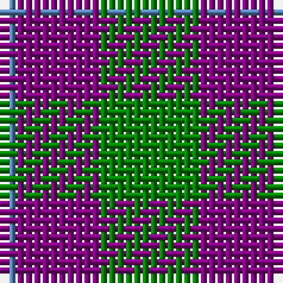

The parent of this is [Wilson's, No 55](/tartans/b/2/p10/g/12/)

This was sourced from weddslist.  It is a [3 stripes tartan](/stripes/stripes3/).

Original link http://www.weddslist.com/cgi-bin/tartans/pg.pl?source=sts

## Thread count
B/2 P10 G/12

## Palette
Each colour and its ΔE from the base-6 reference it is a variant of.

| Colour | Shade | Base | ΔE (OKLab) |
|---|---|---|---|
| B |  `#5480B0` | B  | 0.20 |
| G |  `#008000` | G  | 0.09 |
| P |  `#800080` | B  | 0.17 |

# Sample pattern

ID: /variants/b/2/p10/g/12-b5480b0-g008000-p800080/
