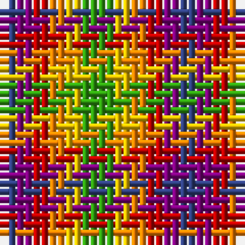

The parent of this is [Rainbow](/tartans/b/2/p2/r2/o2/y2/g/4/)

This was sourced from weddslist.  It is a [6 stripes tartan](/stripes/stripes6/).

Original link http://www.weddslist.com/cgi-bin/tartans/pg.pl?source=sts

## Thread count
B/2 P2 R2 O2 Y2 G/4

## Palette
Each colour and its ΔE from the base-6 reference it is a variant of.

| Colour | Shade | Base | ΔE (OKLab) |
|---|---|---|---|
| B |  `#304080` | B  | 0.01 |
| G |  `#30A010` | G  | 0.19 |
| O |  `#FF8500` | Y  | 0.14 |
| P |  `#800080` | B  | 0.17 |
| R |  `#C00000` | R  | 0.02 |
| Y |  `#F0C000` | Y  | 0.01 |

# Sample pattern

ID: /variants/b/2/p2/r2/o2/y2/g/4-b304080-g30a010-off8500-p800080-rc00000-yf0c000/
