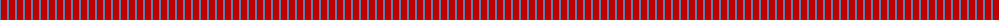
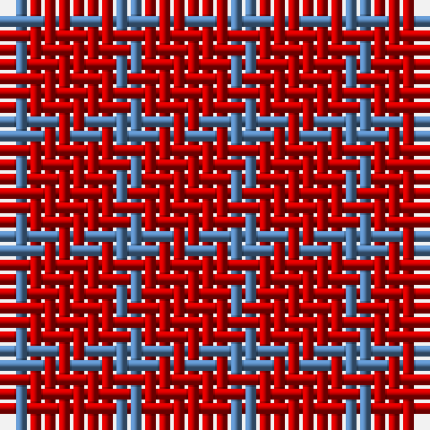

The parent of this is [Wilson's, No 138](/tartans/b/2/r/6/)

This was sourced from weddslist.  It is a [2 stripes tartan](/stripes/stripes2/).

Original link http://www.weddslist.com/cgi-bin/tartans/pg.pl?source=sts

## Thread count
B/2 R/6

## Palette
B R

# Sample pattern

ID: /variants/b/2/r/6-b5480b0-rc00000/
