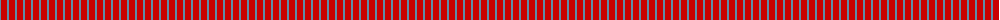
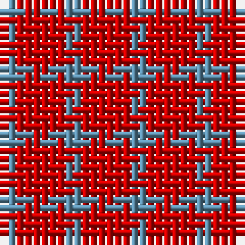

The parent of this is [Wilson's No.138](/tartans/b/2/r/6/)

This was sourced from register-of-tartans.  It is a [2 stripes tartan](/stripes/stripes2/).

Original link https://www.tartanregister.gov.uk/tartanDetails.aspx?ref=4693

## Thread count
B/2 R/6

## Palette
Each colour and its ΔE from the base-6 reference it is a variant of.

| Colour | Shade | Base | ΔE (OKLab) |
|---|---|---|---|
| B |  `#5C8CA8` | B  | 0.23 |
| R |  `#C80000` | R  | 0.00 |

# Sample pattern

ID: /variants/b/2/r/6-b5c8ca8-rc80000/
