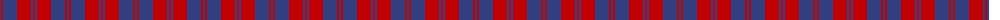
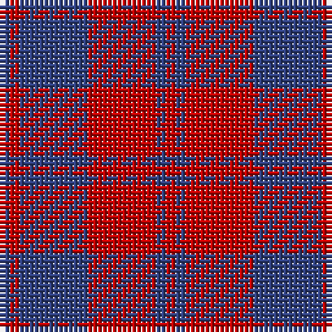

The parent of this is [MacGregor](/tartans/b/2/r2/b14/r14/b2/r/2/)

This was sourced from weddslist.  It is a [6 stripes tartan](/stripes/stripes6/).

Original link http://www.weddslist.com/cgi-bin/tartans/pg.pl?source=sts

## Thread count
B/2 R2 B14 R14 B2 R/2

## Palette
Each colour and its ΔE from the base-6 reference it is a variant of.

| Colour | Shade | Base | ΔE (OKLab) |
|---|---|---|---|
| B |  `#304080` | B  | 0.01 |
| R |  `#C00000` | R  | 0.02 |

# Sample pattern

ID: /variants/b/2/r2/b14/r14/b2/r/2-b304080-rc00000/
