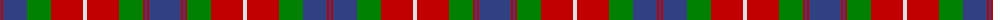

The parent of this is [Fraser of Lovat](/tartans/b/2/r2/b24/g24/r32/ln4/r32/g24/r2/b2/r2/b/32/)

This was sourced from weddslist.  It is a [12 stripes tartan](/stripes/stripes12/).

Original link http://www.weddslist.com/cgi-bin/tartans/pg.pl?source=sts

## Thread count
B/2 R2 B24 G24 R32 LN4 R32 G24 R2 B2 R2 B/32

## Palette
Each colour and its ΔE from the base-6 reference it is a variant of.

| Colour | Shade | Base | ΔE (OKLab) |
|---|---|---|---|
| B |  `#304080` | B  | 0.01 |
| G |  `#008000` | G  | 0.09 |
| LN |  `#E0E0E0` | W  | 0.06 |
| R |  `#C00000` | R  | 0.02 |

ID: /variants/b/2/r2/b24/g24/r32/ln4/r32/g24/r2/b2/r2/b/32-b304080-g008000-lne0e0e0-rc00000/
