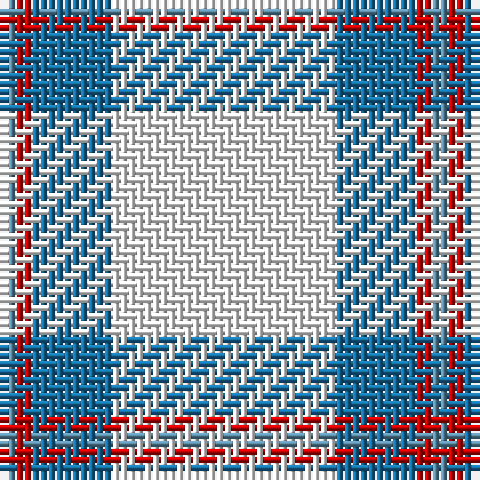

The parent of this is [Triplett, Jack Arnold](/tartans/b/2/r2/ba10/w/28/)

This was sourced from tartans-authority.  It is a [4 stripes tartan](/stripes/stripes4/).

Original link http://www.tartansauthority.com/tartan-ferret/display/10565/

## Thread count
B/2 R2 Ba10 W/28

## Palette
Each colour and its ΔE from the base-6 reference it is a variant of.

| Colour | Shade | Base | ΔE (OKLab) |
|---|---|---|---|
| B |  `#5C8CA8` | B  | 0.23 |
| Ba |  `#1870A4` | B  | 0.14 |
| R |  `#C80000` | R  | 0.00 |
| W |  `#FCFCFC` | W  | 0.03 |

# Sample pattern

ID: /variants/b/2/r2/ba10/w/28-b5c8ca8-ba1870a4-rc80000-wfcfcfc/
