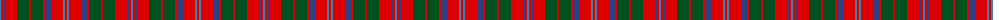

The parent of this is [MacQuarrie](/tartans/b/2/r2/ba2/r12/g12/r2/g12/r2/ba6/r12/b2/r/2/)

This was sourced from register-of-tartans.  It is a [12 stripes tartan](/stripes/stripes12/).

Original link https://www.tartanregister.gov.uk/tartanDetails.aspx?ref=2728

## Thread count
B/2 R2 Ba2 R12 G12 R2 G12 R2 Ba6 R12 B2 R/2

## Palette
Each colour and its ΔE from the base-6 reference it is a variant of.

| Colour | Shade | Base | ΔE (OKLab) |
|---|---|---|---|
| B |  `#3C82AF` | B  | 0.20 |
| Ba |  `#2C4084` | B  | 0.00 |
| G |  `#005020` | G  | 0.08 |
| R |  `#DC0000` | R  | 0.04 |

ID: /variants/b/2/r2/ba2/r12/g12/r2/g12/r2/ba6/r12/b2/r/2-b3c82af-ba2c4084-g005020-rdc0000/
