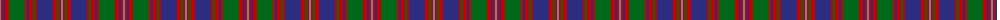

The parent of this is [MacIntyre of Glenorchy Clan Tartan Tartan Number: 402. Earliest known date: 1850 Smiths' version is also known as MacIntyre of Whitehouse. Though different from the sett recorded by Lord Lyon it is the one most often available in modern times. Before moving to Badenoch to take protection for Clan Chattan, the MacIntyres were listed as followers of Stewart of Appin. See products available Copyright © Blair Urquhart, Comrie, 2015](/tartans/b/2/r2/db2/r4/g16/r2/db2/r4/g2/r2/db16/r4/g2/r2/b/2/)

This was sourced from house-of-tartan.  It is a [15 stripes tartan](/stripes/stripes15/).

Original link http://www.house-of-tartan.scotland.net/house/TartanViewjs.asp?colr=Def&tnam=402

## Thread count
B/2 R2 DB2 R4 G16 R2 DB2 R4 G2 R2 DB16 R4 G2 R2 B/2

## Palette
Each colour and its ΔE from the base-6 reference it is a variant of.

| Colour | Shade | Base | ΔE (OKLab) |
|---|---|---|---|
| B |  `#5C8CA8` | B  | 0.23 |
| DB |  `#2C2C80` | B  | 0.05 |
| G |  `#006818` | G  | 0.02 |
| R |  `#C80000` | R  | 0.00 |

ID: /variants/b/2/r2/db2/r4/g16/r2/db2/r4/g2/r2/db16/r4/g2/r2/b/2-b5c8ca8-db2c2c80-g006818-rc80000/
