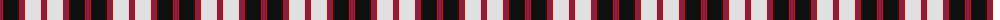

The parent of this is [MacPherson](/tartans/b/2/r2/k16/r2/b2/r2/ln16/r2/b/2/)

This was sourced from register-of-tartans.  It is a [9 stripes tartan](/stripes/stripes9/).

Original link https://www.tartanregister.gov.uk/tartanDetails.aspx?ref=2701

## Thread count
B/2 R2 K16 R2 B2 R2 LN16 R2 B/2

## Palette
Each colour and its ΔE from the base-6 reference it is a variant of.

| Colour | Shade | Base | ΔE (OKLab) |
|---|---|---|---|
| B |  `#2C4084` | B  | 0.00 |
| K |  `#101010` | K  | 0.17 |
| LN |  `#E0E0E0` | W  | 0.06 |
| R |  `#DC0000` | R  | 0.04 |

ID: /variants/b/2/r2/k16/r2/b2/r2/ln16/r2/b/2-b2c4084-k101010-lne0e0e0-rdc0000/
