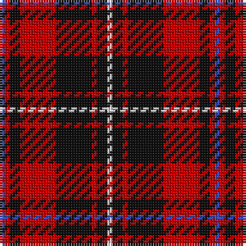

The parent of this is [Nakayama (Fashion)](/tartans/b/2/r2/k4/r14/k14/r2/k4/ln/2/)

This was sourced from tartans-authority.  It is a [8 stripes tartan](/stripes/stripes8/).

Original link http://www.tartansauthority.com/tartan-ferret/display/7742/

## Thread count
B/2 R2 K4 R14 K14 R2 K4 LN/2

## Palette
Each colour and its ΔE from the base-6 reference it is a variant of.

| Colour | Shade | Base | ΔE (OKLab) |
|---|---|---|---|
| B |  `#3850C8` | B  | 0.12 |
| K |  `#101010` | K  | 0.17 |
| LN |  `#E0E0E0` | W  | 0.06 |
| R |  `#C80000` | R  | 0.00 |

# Sample pattern

ID: /variants/b/2/r2/k4/r14/k14/r2/k4/ln/2-b3850c8-k101010-lne0e0e0-rc80000/
