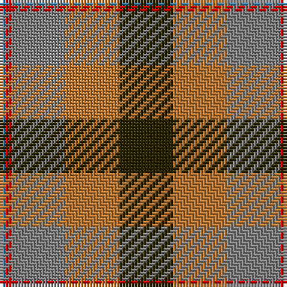

The parent of this is [Jardine #2](/tartans/b/2/r2/n18/do18/k/18/)

This was sourced from register-of-tartans.  It is a [5 stripes tartan](/stripes/stripes5/).

Original link https://www.tartanregister.gov.uk/tartanDetails.aspx?ref=1882

## Thread count
B/2 R2 N18 DO18 K/18

## Palette
Each colour and its ΔE from the base-6 reference it is a variant of.

| Colour | Shade | Base | ΔE (OKLab) |
|---|---|---|---|
| B |  `#3C82AF` | B  | 0.20 |
| DO |  `#BE7832` | R  | 0.17 |
| K |  `#2A2303` | B  | 0.21 |
| N |  `#808080` | G  | 0.22 |
| R |  `#DC0000` | R  | 0.04 |

# Sample pattern

ID: /variants/b/2/r2/n18/do18/k/18-b3c82af-dobe7832-k2a2303-n808080-rdc0000/
