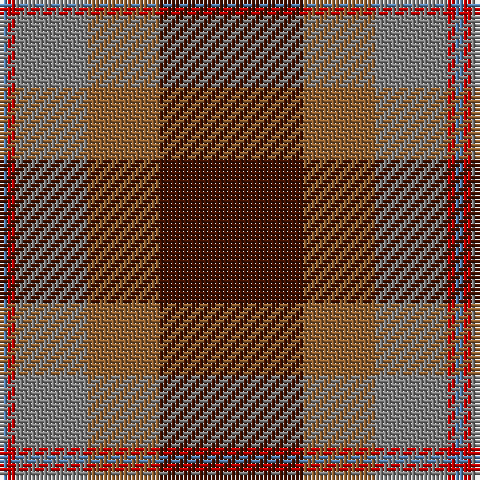

The parent of this is [Jardine](/tartans/b/2/r2/n18/lt18/dr/36/)

This was sourced from weddslist.  It is a [5 stripes tartan](/stripes/stripes5/).

Original link http://www.weddslist.com/cgi-bin/tartans/pg.pl?source=sts

## Thread count
B/2 R2 N18 LT18 DR/36

## Palette
Each colour and its ΔE from the base-6 reference it is a variant of.

| Colour | Shade | Base | ΔE (OKLab) |
|---|---|---|---|
| B |  `#5480B0` | B  | 0.20 |
| DR |  `#401000` | B  | 0.23 |
| LT |  `#906030` | R  | 0.15 |
| N |  `#808080` | G  | 0.22 |
| R |  `#C00000` | R  | 0.02 |

# Sample pattern

ID: /variants/b/2/r2/n18/lt18/dr/36-b5480b0-dr401000-lt906030-n808080-rc00000/
