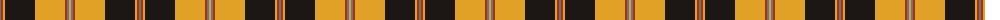
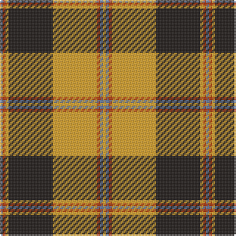

The parent of this is [Pittsburgh St Andrew's Society](/tartans/b/2/r2/y2/k30/y30/r2/b2/y/2/)

This was sourced from register-of-tartans.  It is a [8 stripes tartan](/stripes/stripes8/).

Original link https://www.tartanregister.gov.uk/tartanDetails.aspx?ref=11503

## Thread count
B/2 R2 Y2 K30 Y30 R2 B2 Y/2

## Palette
Each colour and its ΔE from the base-6 reference it is a variant of.

| Colour | Shade | Base | ΔE (OKLab) |
|---|---|---|---|
| B |  `#5F749C` | B  | 0.17 |
| K |  `#1C1714` | K  | 0.21 |
| R |  `#B03000` | R  | 0.05 |
| Y |  `#E0A126` | Y  | 0.08 |

# Sample pattern

ID: /variants/b/2/r2/y2/k30/y30/r2/b2/y/2-b5f749c-k1c1714-rb03000-ye0a126/
