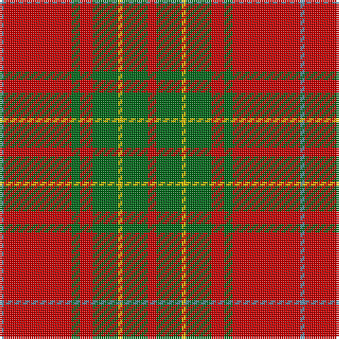

The parent of this is [Burnett of Leys Family Tartan Tartan Number: 2355. Earliest known date: Unknown In Scottish Tartan Society Files but source unknown. At present woven by Lochcarron. The entry in the Lyon Court Books does not define the pattern. See products available Copyright © Blair Urquhart, Comrie, 2015](/tartans/b/2/r32/g4/r6/g12/y2/g12/r/4/)

This was sourced from house-of-tartan.  It is a [8 stripes tartan](/stripes/stripes8/).

Original link http://www.house-of-tartan.scotland.net/house/TartanViewjs.asp?colr=Def&tnam=2355

## Thread count
B/2 R32 G4 R6 G12 Y2 G12 R/4

## Palette
Each colour and its ΔE from the base-6 reference it is a variant of.

| Colour | Shade | Base | ΔE (OKLab) |
|---|---|---|---|
| B |  `#5C8CA8` | B  | 0.23 |
| DB |  `#2C2C80` | B  | 0.05 |
| G |  `#006818` | G  | 0.02 |
| R |  `#C80000` | R  | 0.00 |
| Y |  `#E8C000` | Y  | 0.00 |

# Sample pattern

ID: /variants/b/2/r32/g4/r6/g12/y2/g12/r/4-b5c8ca8-db2c2c80-g006818-rc80000-ye8c000/
