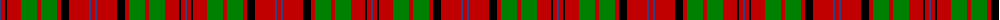

The parent of this is [MacQuarrie, Ancient](/tartans/b/2/r4/k2/r14/g16/r4/g16/r4/k8/r20/b2/r/4/)

This was sourced from weddslist.  It is a [12 stripes tartan](/stripes/stripes12/).

Original link http://www.weddslist.com/cgi-bin/tartans/pg.pl?source=sts

## Thread count
B/2 R4 K2 R14 G16 R4 G16 R4 K8 R20 B2 R/4

## Palette
Each colour and its ΔE from the base-6 reference it is a variant of.

| Colour | Shade | Base | ΔE (OKLab) |
|---|---|---|---|
| B |  `#304080` | B  | 0.01 |
| G |  `#008000` | G  | 0.09 |
| K |  `#000000` | K  | 0.00 |
| R |  `#C00000` | R  | 0.02 |

ID: /variants/b/2/r4/k2/r14/g16/r4/g16/r4/k8/r20/b2/r/4-b304080-g008000-k000000-rc00000/
