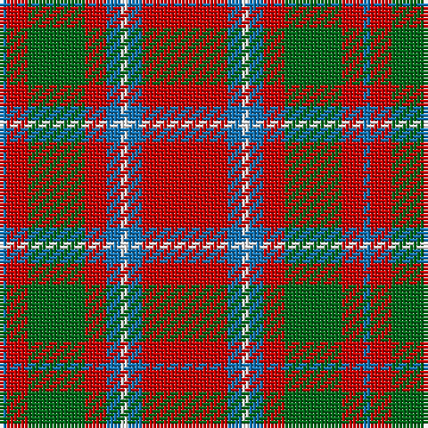

The parent of this is [Chisholm, The](/tartans/b/2/r6/g16/r6/b4/w2/b4/r/24/)

This was sourced from register-of-tartans.  It is a [8 stripes tartan](/stripes/stripes8/).

Original link https://www.tartanregister.gov.uk/tartanDetails.aspx?ref=643

## Thread count
B/2 R6 G16 R6 B4 W2 B4 R/24

## Palette
Each colour and its ΔE from the base-6 reference it is a variant of.

| Colour | Shade | Base | ΔE (OKLab) |
|---|---|---|---|
| B |  `#1474B4` | B  | 0.15 |
| G |  `#006818` | G  | 0.02 |
| R |  `#C80000` | R  | 0.00 |
| W |  `#FCFCFC` | W  | 0.03 |

# Sample pattern

ID: /variants/b/2/r6/g16/r6/b4/w2/b4/r/24-b1474b4-g006818-rc80000-wfcfcfc/
