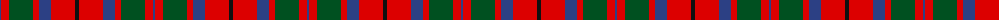

The parent of this is [MacBean/MacElvain](/tartans/b/2/r8/g24/r6/b12/r24/k/4/)

This was sourced from register-of-tartans.  It is a [7 stripes tartan](/stripes/stripes7/).

Original link https://www.tartanregister.gov.uk/tartanDetails.aspx?ref=2296

## Thread count
B/2 R8 G24 R6 B12 R24 K/4

## Palette
Each colour and its ΔE from the base-6 reference it is a variant of.

| Colour | Shade | Base | ΔE (OKLab) |
|---|---|---|---|
| B |  `#2C4084` | B  | 0.00 |
| G |  `#005020` | G  | 0.08 |
| K |  `#101010` | K  | 0.17 |
| R |  `#DC0000` | R  | 0.04 |

# Sample pattern

ID: /variants/b/2/r8/g24/r6/b12/r24/k/4-b2c4084-g005020-k101010-rdc0000/
