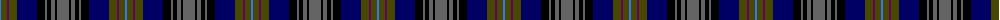

The parent of this is [Wcwm 1893-2](/tartans/b/2/t6/p2/t8/db20/k8/n2/k4/n4/k2/n/12/)

This was sourced from register-of-tartans.  It is a [11 stripes tartan](/stripes/stripes11/).

Original link https://www.tartanregister.gov.uk/tartanDetails.aspx?ref=4548

## Thread count
B/2 T6 P2 T8 DB20 K8 N2 K4 N4 K2 N/12

## Palette
Each colour and its ΔE from the base-6 reference it is a variant of.

| Colour | Shade | Base | ΔE (OKLab) |
|---|---|---|---|
| B |  `#3474FC` | B  | 0.23 |
| DB |  `#000064` | B  | 0.17 |
| K |  `#000000` | K  | 0.00 |
| N |  `#646464` | B  | 0.16 |
| P |  `#640064` | B  | 0.15 |
| T |  `#484800` | G  | 0.10 |

ID: /variants/b/2/t6/p2/t8/db20/k8/n2/k4/n4/k2/n/12-b3474fc-db000064-k000000-n646464-p640064-t484800/
