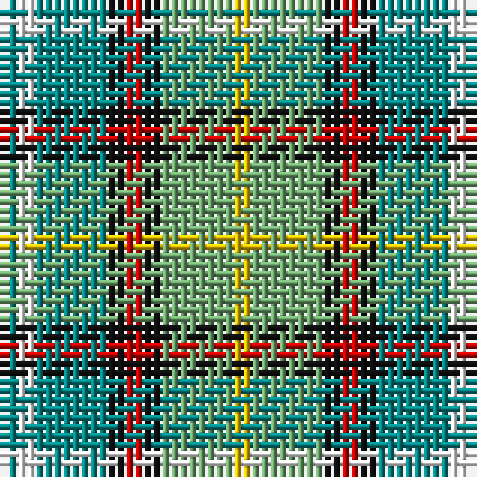

The parent of this is [Dunedin (NZ) (District)](/tartans/b/2/w2/b8/k2/r2/k2/lg8/y/2/)

This was sourced from tartans-authority.  It is a [8 stripes tartan](/stripes/stripes8/).

Original link http://www.tartansauthority.com/tartan-ferret/display/2114/

## Thread count
B/2 W2 B8 K2 R2 K2 LG8 Y/2

## Palette
Each colour and its ΔE from the base-6 reference it is a variant of.

| Colour | Shade | Base | ΔE (OKLab) |
|---|---|---|---|
| B |  `#048888` | G  | 0.18 |
| K |  `#101010` | K  | 0.17 |
| LG |  `#70A870` | Y  | 0.19 |
| R |  `#C80000` | R  | 0.00 |
| W |  `#FCFCFC` | W  | 0.03 |
| Y |  `#E8C000` | Y  | 0.00 |

# Sample pattern

ID: /variants/b/2/w2/b8/k2/r2/k2/lg8/y/2-b048888-k101010-lg70a870-rc80000-wfcfcfc-ye8c000/
