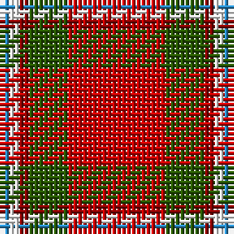

The parent of this is [Staves (Personal)](/tartans/b/2/w2/dr2/g8/r/20/)

This was sourced from tartans-authority.  It is a [5 stripes tartan](/stripes/stripes5/).

Original link http://www.tartansauthority.com/tartan-ferret/display/6611/

## Thread count
B/2 W2 DR2 G8 R/20

## Palette
Each colour and its ΔE from the base-6 reference it is a variant of.

| Colour | Shade | Base | ΔE (OKLab) |
|---|---|---|---|
| B |  `#2888C4` | B  | 0.21 |
| DR |  `#880000` | R  | 0.14 |
| G |  `#285800` | G  | 0.04 |
| R |  `#C80000` | R  | 0.00 |
| W |  `#FCFCFC` | W  | 0.03 |

# Sample pattern

ID: /variants/b/2/w2/dr2/g8/r/20-b2888c4-dr880000-g285800-rc80000-wfcfcfc/
