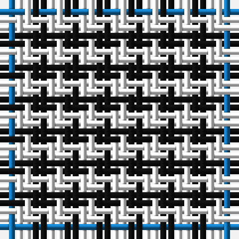

The parent of this is [Haig Check (Estate Check)](/tartans/b/2/w2/k2/w2/k2/w2/k2/w/2/)

This was sourced from tartans-authority.  It is a [8 stripes tartan](/stripes/stripes8/).

Original link http://www.tartansauthority.com/tartan-ferret/display/6244/

## Thread count
B/2 W2 K2 W2 K2 W2 K2 W/2

## Palette
Each colour and its ΔE from the base-6 reference it is a variant of.

| Colour | Shade | Base | ΔE (OKLab) |
|---|---|---|---|
| B |  `#1474B4` | B  | 0.15 |
| K |  `#101010` | K  | 0.17 |
| W |  `#FCFCFC` | W  | 0.03 |

# Sample pattern

ID: /variants/b/2/w2/k2/w2/k2/w2/k2/w/2-b1474b4-k101010-wfcfcfc/
