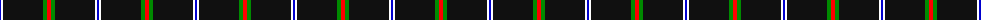
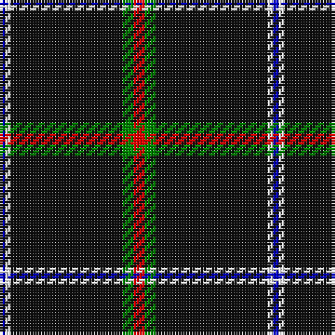

The parent of this is [Fily, Sylvain Roger](/tartans/b/2/w2/k40/g4/r/4/)

This was sourced from register-of-tartans.  It is a [5 stripes tartan](/stripes/stripes5/).

Original link https://www.tartanregister.gov.uk/tartanDetails.aspx?ref=10277

## Thread count
B/2 W2 K40 G4 R/4

## Palette
Each colour and its ΔE from the base-6 reference it is a variant of.

| Colour | Shade | Base | ΔE (OKLab) |
|---|---|---|---|
| B |  `#0000CD` | B  | 0.15 |
| G |  `#008B00` | G  | 0.12 |
| K |  `#101010` | K  | 0.17 |
| R |  `#FF0000` | R  | 0.11 |
| W |  `#FFFFFF` | W  | 0.03 |

# Sample pattern

ID: /variants/b/2/w2/k40/g4/r/4-b0000cd-g008b00-k101010-rff0000-wffffff/
