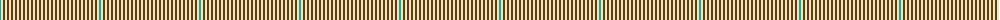

The parent of this is [Tulchan Estate Check (Corporate)](/tartans/b/2/w2/t2/w2/t2/w2/t2/w2/t2/w2/t2/w2/t2/w2/t2/w2/t2/w2/t2/w2/t2/w2/t2/w2/t2/w/2/)

This was sourced from tartans-authority.  It is a [26 stripes tartan](/stripes/stripes26/).

Original link http://www.tartansauthority.com/tartan-ferret/display/7925/

## Thread count
B/2 W2 T2 W2 T2 W2 T2 W2 T2 W2 T2 W2 T2 W2 T2 W2 T2 W2 T2 W2 T2 W2 T2 W2 T2 W/2

## Palette
Each colour and its ΔE from the base-6 reference it is a variant of.

| Colour | Shade | Base | ΔE (OKLab) |
|---|---|---|---|
| B |  `#1CA880` | G  | 0.23 |
| T |  `#604000` | G  | 0.14 |
| W |  `#F0E4CC` | W  | 0.05 |

ID: /variants/b/2/w2/t2/w2/t2/w2/t2/w2/t2/w2/t2/w2/t2/w2/t2/w2/t2/w2/t2/w2/t2/w2/t2/w2/t2/w/2-b1ca880-t604000-wf0e4cc/
