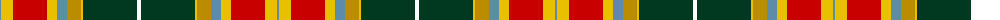

The parent of this is [Elystan Glodrydd (Name)](/tartans/b/2/y12/r34/y10/b10/dy14/y2/dg54/w/4/)

This was sourced from tartans-authority.  It is a [9 stripes tartan](/stripes/stripes9/).

Original link http://www.tartansauthority.com/tartan-ferret/display/10677/

## Thread count
B/2 Y12 R34 Y10 B10 DY14 Y2 DG54 W/4

## Palette
Each colour and its ΔE from the base-6 reference it is a variant of.

| Colour | Shade | Base | ΔE (OKLab) |
|---|---|---|---|
| B |  `#5C8CA8` | B  | 0.23 |
| DG |  `#003820` | G  | 0.16 |
| DY |  `#BC8C00` | Y  | 0.16 |
| R |  `#C80000` | R  | 0.00 |
| W |  `#FCFCFC` | W  | 0.03 |
| Y |  `#E8C000` | Y  | 0.00 |

ID: /variants/b/2/y12/r34/y10/b10/dy14/y2/dg54/w/4-b5c8ca8-dg003820-dybc8c00-rc80000-wfcfcfc-ye8c000/
