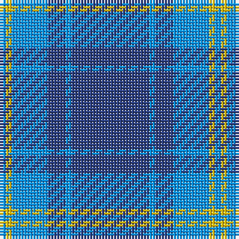

The parent of this is [Hepburn #2](/tartans/b/2/y2/b12/ba6/b2/ba/26/)

This was sourced from register-of-tartans.  It is a [6 stripes tartan](/stripes/stripes6/).

Original link https://www.tartanregister.gov.uk/tartanDetails.aspx?ref=1689

## Thread count
B/2 Y2 B12 Ba6 B2 Ba/26

## Palette
Each colour and its ΔE from the base-6 reference it is a variant of.

| Colour | Shade | Base | ΔE (OKLab) |
|---|---|---|---|
| B |  `#0596FA` | B  | 0.28 |
| Ba |  `#2C4084` | B  | 0.00 |
| Y |  `#E8C000` | Y  | 0.00 |

# Sample pattern

ID: /variants/b/2/y2/b12/ba6/b2/ba/26-b0596fa-ba2c4084-ye8c000/
