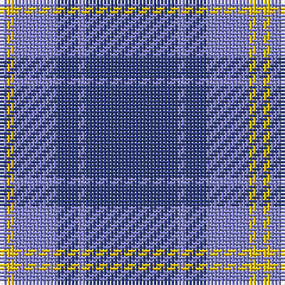

The parent of this is [Hepburn](/tartans/b/2/y2/b12/ba6/b2/ba/26/)

This was sourced from weddslist.  It is a [6 stripes tartan](/stripes/stripes6/).

Original link http://www.weddslist.com/cgi-bin/tartans/pg.pl?source=sts

## Thread count
B/2 Y2 B12 Ba6 B2 Ba/26

## Palette
Each colour and its ΔE from the base-6 reference it is a variant of.

| Colour | Shade | Base | ΔE (OKLab) |
|---|---|---|---|
| B |  `#8080D0` | B  | 0.24 |
| Ba |  `#304080` | B  | 0.01 |
| Y |  `#F0C000` | Y  | 0.01 |

# Sample pattern

ID: /variants/b/2/y2/b12/ba6/b2/ba/26-b8080d0-ba304080-yf0c000/
